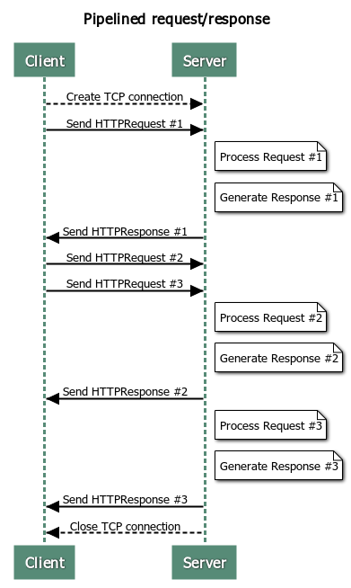

# HTTP-Web-Server

## Spec Summary

This is a web server that implements a subset of the HTTP/1.1 protocol specification.

### Basic Web Server Functionality

At a high level, a web server listens for connections on a socket (bound to a specific port on a host machine). Clients connect to this socket and use the HTTP protocol to retrieve files from the server. This server will read data from the client, using the framing and parsing techniques to interpret one or more requests (if the client is using pipelined requests). Every time the server reads in a full request, it will service that request and send a response back to the client. After sending back one (or more) responses, the server will either close the connection (if instructed to do so by the client via the “Connection: close” header, described below), or after an appropriate timeout occurs (also described below). The web server will then continue waiting for future client connections. Also, this server is implemented in a concurrent manner, which means that it can process multiple client requests overlapping in time.

<p align="center">
  
</p>

### HTTP Messages

This HTTP web server follows the [general HTTP message format](https://developer.mozilla.org/en-US/docs/Web/HTTP/Messages). Its request and response messages are plain-text ASCII (the body of a response can also contain binary data). Both requests and responses start with a header section. Responses optionally contain a body section which is separated from the header section by a blank line. The header consists of an initial line (which is different between requests and responses), followed by zero or more key-value pairs. Every line is terminated by a CRLF (carriage-return followed by a line feed, or “\r\n”).

A request message has this form：
```
<initial request line>[CRLF]
Key1: value1[CRLF]
Key2: value2[CRLF]
...
KeyN: valueN[CRLF]
[CRLF]
```

A response message has this form：

```
<initial response line>[CRLF]
Key1: value1[CRLF]
Key2: value2[CRLF]
...
KeyN: valueN[CRLF]
[CRLF]
<optional body>
```

Initial Request Line
```
GET <URL> HTTP/1.1
```

Initial Response Line
```
HTTP/1.1 <status code> <status description>
```

Header Lines
```
<key><colon>(<space>*)<value><CRLF>
```

Below are some further specifications：

- HTTP version supported： `HTTP/1.1`
- Request method supported： `GET`
- Response status supported：
  - `200 OK`
  - `400 Bad Request`
  - `404 Not Found`
- Request headers：
  - `Host` (required)
  - `Connection` (optional, `Connection: close` has special meaning influencing server logic)
  - Other headers are allowed, but won't have any effect on the server logic
- Response headers：
  - `Date` (required)
  - `Last-Modified` (required for a `200` response)
  - `Content-Type` (required for a `200` response)
  - `Content-Length` (required for a `200` response)
  - `Connection: close` (required in response for a `Connection: close` request, or for a `400` response)
  - Response headers should be written in sorted order for the ease of testing

### Server Logic

When to send a `200` response：
- When a valid request is received, and the requested file can be found.

When to send a `404` response：
- When a valid request is received, and the requested file cannot be found or is not under the doc root.

When to send a `400` response：
- When an invalid request is received.
- When timeout occurs and a partial request is received.

When to close the connection：
- When timeout occurs and no partial request is received.
- When EOF occurs.
- After sending a `400` response.
- After handling a valid request with a `Connection: close` header.

When to update the timeout：
- When trying to read a new request.

What is the timeout value：
- 5 seconds.

## Usage

Install the `httpd` command to a local `bin` directory:
```
make install
ls bin
```

Check the command help message:
```
bin/httpd -h
```

An alternative way to run the command:
```
go run cmd/httpd/main.go -h
```